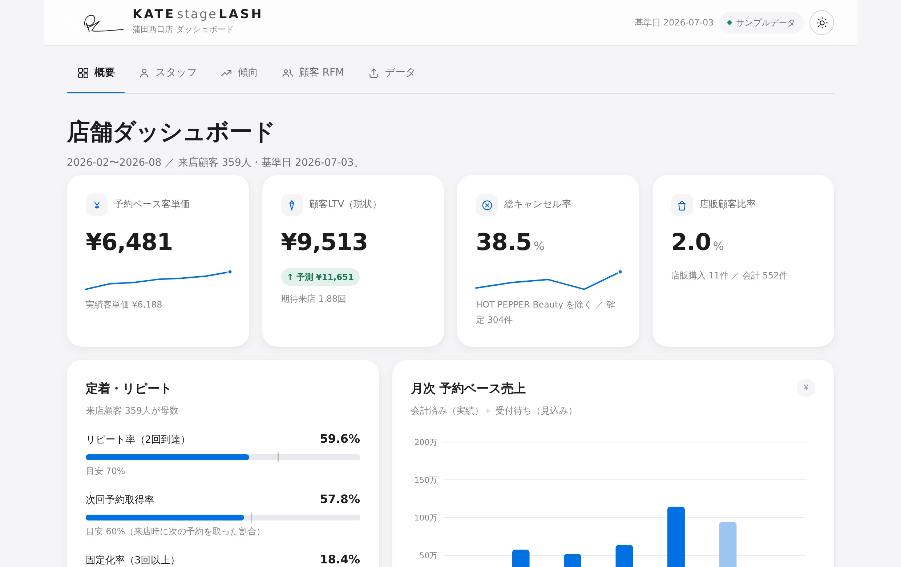

# KATEstageLASH 蒲田西口店 — KPIダッシュボード

> 予約データを入れるだけで、店舗の状況がひと目でわかる。まつげ・眉毛サロン向けの
> **予約ベースKPIダッシュボード**。完全クライアントサイド・モバイルファースト・
> ダーク/ライト対応。

「予約データ」シート（HOT PEPPER Beauty 等の予約エクスポート形式）を
アップロードするだけで、店舗全体・スタッフ・傾向・RFM顧客分析を、
おしゃれで動的なグラフとして自動生成します。データはすべてブラウザ内で処理され、
どこにも送信されません。

<p align="center"></p>

---

## ✨ 特長

- **入れるだけ** — Googleスプレッドシート連携、または 予約データ（`.xlsx` / `.csv`）のドラッグ&ドロップで全指標を自動再計算。
- **予約ベースの視点** — 会計済み（実績）＋これからの受付待ち（見込み）を合わせて店舗の“今”を捉える。
- **5つのビュー**
  - **概要** — 予約ベース売上KGI・客単価・リピート/定着・キャンセル・LTV・月次推移・経路・来店回数構成
  - **スタッフ** — momo / aoi の月次比較（予約数・売上・客単価・次回予約率・育成力）
  - **傾向** — 曜日別パフォーマンス・月次コホート（リピート率/LTV）・人気クーポン
  - **顧客 RFM** — 9セグメント分類・F×R ヒートマップ・顧客明細（並べ替え可）
  - **データ** — アップロード・現在のデータ・計算ロジック
- **一流のデザイン** — Noto Sans JP の読みやすい数字、光沢メーター、リテンションファネル、なめらかなアニメーション。
- **モバイルファースト & レスポンシブ** — 下部ナビ、2カラムのタイル、横スクロールするテーブル、`prefers-reduced-motion` 対応。
- **アクセシブル** — カラーバリアフリー検証済みパレット、キーボード操作、ARIA、ダーク/ライト個別調整。
- **依存ゼロ（実行時）** — 手書きのSVGチャート。Excel読込のみ SheetJS を同梱（ベンダー済み）。

## 🚀 使い方

### 1. そのまま開く
`index.html` をブラウザで開くだけ（同梱のサンプルデータで全機能が動きます）。

### 2. GitHub Pages で公開する（自動デプロイ）
`main` へ push すると `.github/workflows/pages.yml` が自動でPagesへデプロイします。
Pages の有効化もワークフローが自動で行うため（`enablement: true`）、**設定作業は不要**です。
数分後に `https://<ユーザー名>.github.io/KATE-KPI/` で公開されます。（`.nojekyll` 同梱）

### 3. Googleスプレッドシートと連携する（おすすめ）
スプレッドシートに予約データを入れ、`データ` タブでその **URL を貼るだけ**。以後、ページを
開くたびに最新の内容を自動で読み込みます。

- 確実な方法：スプレッドシートで `ファイル → 共有 → ウェブに公開 → CSV` を選び、そのURLを貼付。
- または、共有を「リンクを知っている全員（閲覧者）」にして編集URLを貼付。
- 1行目の見出しは「予約データ」シートと同じ日本語列にしてください（`data/template.csv` をインポートすると簡単）。
- ⚠ 公開／共有したスプレッドシートはURLを知る人が閲覧できます。個人情報を含む場合は、下記のファイル読込（非公開）をご利用ください。

### 4. 自分の予約データファイルで見る
`データ` タブで、「予約データ」シートを含む `.xlsx` か `.csv` をドロップ／選択します。
列は日本語の見出し名で自動認識するため、列の並び順は自由です。

> 主要な認識列：`ステータス` `来店日` `スタッフ名` `予約経路` `フリガナ` `お名前`
> `予約時メニュー` `予約時HotPepperBeautyクーポン` `予約時合計金額` `会計時合計金額` ほか。

## 📐 指標の計算ロジック（元KPIワークブック準拠）

| 指標 | 定義 |
|---|---|
| **予約ベース売上** | 会計済みの `会計時合計金額`（実績）＋ 集計基準日より後の受付待ちの `予約時合計金額`（見込み） |
| **有効予約** | 会計済み ＋ これからの受付待ち予約（基準日以前の未処理＝滞留は除外） |
| **集計基準日** | 会計済みの最終来店日（アップロード時は自動、サンプルは 2026-07-03） |
| **顧客の識別** | `フリガナ` で名寄せ（なければ 氏名＋電話）。リピート/RFMの母数は来店実績のある顧客 |
| **リピート率 / 定着率** | 来店顧客のうち 2回目 / 3回以上の予約（会計済み＋今後の予約）を確保した割合 |
| **次回予約取得率** | 来店ごとに、その後の予約が存在した割合 |
| **RFM** | R＝最終来店からの日数、F＝**実来店回数**、M＝累計売上。R点/F点から9セグメントに自動分類 |
| **LTV** | 現状＝実績売上÷来店顧客数、予測＝実績客単価×期待来店回数 |

計算エンジンは元のExcelワークブック（`店舗全体`/`各スタッフ`/`傾向分析`/`RFM分析`）の
公表値に対して検証済みで、`tests/validate.js` の **71項目すべてに合格**します
（元データが1行だけ除外していた端数を除き、売上は1円単位まで一致）。

```bash
node tests/validate.js   # エンジンの回帰テスト（サンプルデータ vs 公表値）
```

## 🗂 構成

```
index.html                 アプリシェル（タブ/下部ナビ/ビュー枠）
.github/workflows/pages.yml GitHub Pages 自動デプロイ
assets/
  css/styles.css           デザインシステム ※Noto Sans JP
  js/
    engine.js              分析エンジン（予約データ → 全KPI）※検証済み
    ingest.js              CSV/XLSX 取り込み・列マッピング・顧客キー
    sheets.js              Googleスプレッドシート連携（URL→CSV取得）
    charts.js              手書きSVGチャート（線/棒/ドーナツ/ファネル/ヒートマップ 他）
    app.js                 ビュー描画・ルーティング・テーマ・アップロード・連携
    sample-data.js         匿名化サンプル予約データ（分析特性は保持）
    vendor/xlsx.mini.min.js  SheetJS（Excel読込のみ・同梱）
data/
  template.csv             スプレッドシート用の見出しテンプレート
  reservations.sample.json サンプルデータ ／ ground-truth.json 検証用
docs/                      設計ブリーフ・スクリーンショット
tests/validate.js          回帰テスト
```

## 🔐 プライバシー

アップロードした予約データ（氏名・電話番号などを含む）は**ブラウザ内でのみ**処理され、
サーバーには一切送信されません。同梱のサンプルは、分析上の性質を保ったまま氏名を
疑似名に匿名化しています。

## 🎨 デザイン

データ色はカラーバリアフリー検証（`dataviz` 基準）に合格したパレットを使用しています。
※デザインは「エディトリアル方向 ＋ 店舗ブランド（KATEstageLASH）準拠」で刷新中です。

---

<sub>予約データはお使いのブラウザから外に出ません。Made with care for KATE.</sub>
